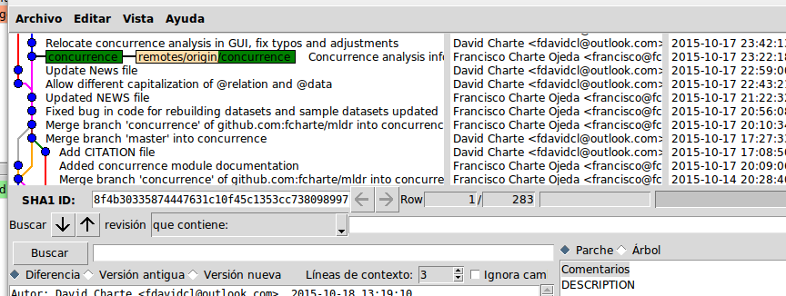
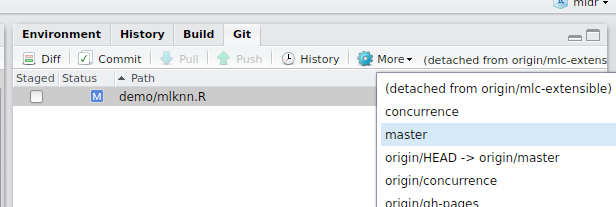

# Git + GitHub

## Git

* Sistema de control de versiones de código 

* Disponible para todos los sistemas operativos

* Funcionamiento distribuido

* Línea de comandos + GUI básica

## Comandos de Git

* Configuración

    `git config --global user.name "[nombre]"`  
    `git config --global user.email "[correo]"`
    
* Comandos básicos

    `git init`  -  Inicialización de un nuevo repositorio
    `git status` - Comprobar el estado del repositorio
    `git add` - Registrar cambios en la *stage* area
    `git commit`- Confirmar cambios en la *stage* area
    `git diff` - Diferencias entre versiones de archivo
    `git log` - Registro de operaciones en el repositorio

## Comandos de Git (cont.)

* Deshacer cambios

    `git checkout "[archivo]"` - Restablecer archivo local 
    `git reset "[commit]"` - Eliminar *commits*
    `git revert "[commit]"` - Deshacer cambios 
    
* Repositorios remotos

    `git clone` - Clona un repositorio existente
    `git remote add "[nombre]" "[dirección]"` - Agregar nuevo repositorio remoto
    
    `git pull` - Traer cambios desde repositorio remoto
    `git push` - Envíar cambios al repositorio remoto

## Comandos de Git (cont.)

* Ramas

    `git branch` - Ver las ramas existentes
    `git branch "[nombre]"`- Crea nueva rama
    `git checkout "[rama]"` - Cambia a la rama indicada
    `git merge "[rama]"` - Fusionar cambios con rama actual
    `git branch -d "[rama]"` - Eliminar una rama

## {.titleslide#backslide}

<!--link href='http://fonts.googleapis.com/css?family=Open Sans:400,300,700' rel='stylesheet' type='text/css'-->

